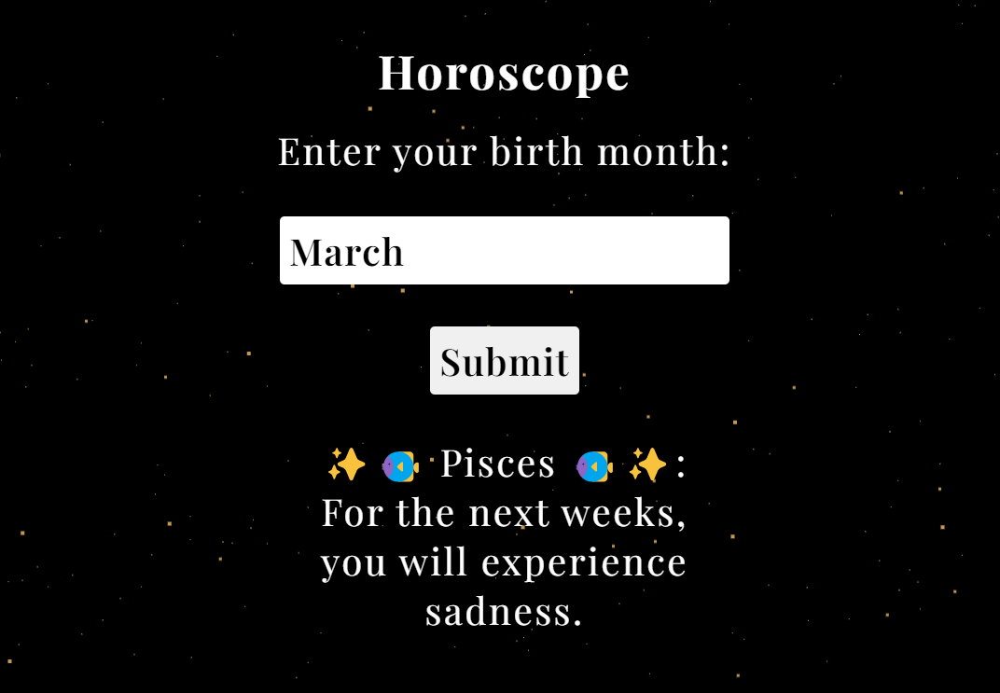

# Project: Horoscope

## A very simple webpage where you can read your horoscope. (Psst. Take it with a grand of salt 😉)

## Website here: [https://horoscope-eight-delta.vercel.app/](https://horoscope-eight-delta.vercel.app/)

## Programs used 🛠️
- Webstorm (HTML, CSS, JavaScript)
- Sourcetree (push project to Github)
- Vercel (deploy webpage)

## Features 🌟
- Animation stars background
- Type in your month and click submit to get a sentence
- The sentence you based on your month will not change if you submit the same month
- Responsive page

## Contact:

### [My Linkedin](https://www.linkedin.com/in/line-svensen-967131122/)

### [My Github profile](https://github.com/LineSvensen)

### BR, Line